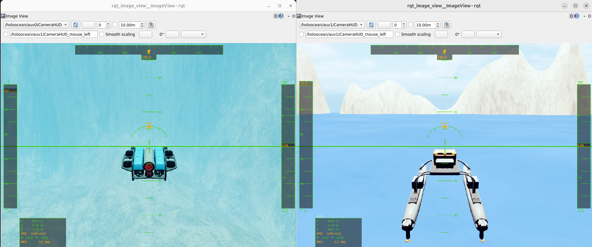
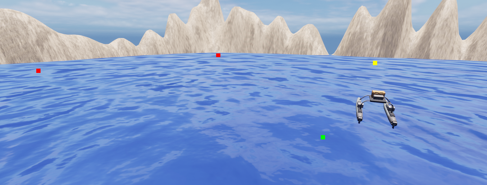

# 水域载具 ROS2 接口

针对高保真海洋机器人模块 [HoloOcean](https://github.com/OpenHUTB/hutb/tree/hutb/Unreal/CarlaUE4/Plugins/HoloOcean) 的 ROS 2 集成方案。该软件包将 HoloOcean Python API 与 ROS 2 网络连接起来，以 Topic（话题）形式发布传感器数据，并通过 Subscription（订阅）和 Service（服务）接收控制指令。


## HoloOcean ROS (0.0.1) 新特性
  - 改进了游戏手柄（joystick）示例
  - 新增多代理（multi-agent）游戏手柄示例
  - 简化了代理指令（弃用 `command/control` 话题，改用 `command/agent`）
  - 新增传感器旋转指令
  - 修复了少量错误并改进了 Docker 配置
  - 软件包


## 软件包

| 软件包 | 描述 |
|---|---|
| `holoocean_main` | 核心仿真节点：加载场景并施加环境更新节拍 |
| `holoocean_interfaces` | 自定义 ROS 2 消息与服务定义 |
| `holoocean_examples` | 示例节点：操纵杆控制、航点跟踪、深度/航向指令 |


## 先决条件

- ROS 2（已在 Humble 和 Jazzy 版本上测试）
- HoloOcean Python 软件包 — [源代码](https://github.com/OpenHUTB/hutb/tree/hutb/Unreal/CarlaUE4/Plugins/HoloOcean) / [文档](https://openhutb.github.io/mujoco_plugin/underwater/)

**注意：** 请避免在 ROS 2 和 HoloOcean 中使用 Python 虚拟环境（如 Conda），因为这可能导致运行时及依赖项问题。


## 安装

### Docker（推荐）

请参阅 [docker/README.md](./docker.md) 获取设置说明。提供[开发](./docker_dev.md)和[运行时](./docker_runtime.md)两种配置。


### 从源码安装
安装 HoloOcean 后，将此仓库克隆到您的 ROS 2 工作空间中：
```bash
cd ros2_ws/src
git clone https://github.com/byu-holoocean/holoocean-ros.git
cd ..
source /opt/ros/humble/setup.bash
colcon build
source install/setup.bash
```

## 快速入门

```bash
ros2 launch holoocean_main holoocean_launch.py
```

## 示例

### 操纵杆控制

使用 `Joy_linux` 包通过操纵杆控制 HoloOcean 中的代理。

```bash
ros2 launch holoocean_examples joy_launch.py
```

请参阅 [holoocean_examples.md](./holoocean_examples.md)，获取完整的设置说明、按键映射及配置参考。




### 航点跟踪

根据预设的航点列表控制水面船舶。

```bash
ros2 launch holoocean_examples waypoint_launch.py
```



### 深度、航向及速度指令

利用 Fossen 控制器向鱼雷型 AUV 发送深度、航向及速度指令。

```bash
ros2 launch holoocean_examples command_launch.py
```

## 节点引用：`holoocean_node`
加载场景 JSON 文件，启动 HoloOcean 环境，并在后台线程中驱动其运行（执行 tick 操作）。

### 订阅的话题

| 话题 | 类型 | 描述 |
|---|---|---|
| `command/agent` | `AgentCommand` | Thruster/actuator commands for all agents (for Fossen agents, messages with `frame_id` set to `body` are routed to the Fossen `set_u_control` interface) |
| `command/sensor` | `SensorCommand` | Sensor configuration commands (e.g. camera rotation) |
| `depth` | `DesiredCommand` | Depth setpoint for autopilot mode |
| `heading` | `DesiredCommand` | Heading setpoint for autopilot mode |
| `speed` | `DesiredCommand` | Speed setpoint for autopilot mode |
| `debug/points` | `visualization_msgs/Marker` | Debug points to draw in the simulation |

### 发布的话题

| 话题 | 类型 | 描述 |
|---|---|---|
| `<agent>/<SensorName>` | varies | Sensor data for each agent (see below) |
| `/clock` | `rosgraph_msgs/Clock` | Simulation time |

传感器话题名称遵循 `<agent_name>/<sensor_name>` 的格式。如果场景文件中未指定传感器名称，则默认使用传感器类型名称。


### 服务

| Service | Type | Description |
|---|---|---|
| `reset` | `std_srvs/Trigger` | Reset the simulation environment |
| `control_mode` | `SetControlMode` | Change an agent's control mode |

### 参数

| Parameter | Type | Default | Description |
|---|---|---|---|
| `scenario_path` | string | `""` | Path to the scenario JSON file |
| `relative_path` | bool | `true` | Resolve `scenario_path` relative to the package share directory |
| `show_viewport` | bool | `true` | Show the Unreal Engine viewport window |
| `draw_arrow` | bool | `true` | Draw a heading arrow for each Fossen agent in the simulation |
| `render_quality` | int | `-1` | Render quality: 0 = low, 1 = normal, 2 = high. -1 = default |
| `publish_commands` | bool | `true` | Publish computed control surface commands back to ROS |

## 记录传感器数据

```bash
ros2 bag record /holoocean/auv0/RotationSensor /holoocean/auv0/LocationSensor
```

有关更多信息，请参阅 [ROS 2 bag 文档](https://docs.ros.org/en/humble/Tutorials/Beginner-CLI-Tools/Recording-And-Playing-Back-Data/Recording-And-Playing-Back-Data.html)。


## 注意

- 模拟时间可能比实际时间（wall time）运行得更快或更慢。请使用 `/clock` 话题将节点与仿真时间[同步](https://design.ros2.org/articles/clock_and_time.html)。

## 参考

* [byu-holoocean/holoocean-ros](https://github.com/byu-holoocean/holoocean-ros)

- [HoloOcean repository](https://github.com/byu-holoocean/HoloOcean)
- [HoloOcean documentation](https://byu-holoocean.github.io/holoocean-docs/)
- [ROS 2 documentation](https://docs.ros.org/en/humble/index.html)


